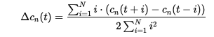

<h2>
  🎙️ EVRecognizer: Emotion Voice Recognizer for Mental Health Monitoring
</h2>

---

EVRecognizer is an end-to-end deep learning system designed to recognize emotions from speech audio.  
This project simulates a **mental health phone call monitoring service**, allowing supervisors or mental health professionals to track calls and automatically detect urgent emotional states that require attention (e.g., **angry**, **fearful**, or **sad**).

The system includes:
- **Training pipeline**: Train and fine-tune a CNN model using labeled datasets and user feedback.
- **Streamlit web app**: Real-time emotion prediction, urgent call highlighting, and feedback correction.
- **Automated run pipeline**: One command to clean, train, fine-tune, evaluate, and generate visualizations.

---

## 📁 Project Structure & Important Files
### Core folders
```
EVRecognizer/
├── data/
│ └── background_noises/
│ ├── 1-8a5284bc.wav
│ ├── 1-df56cada.wav
│ ├── 2-8a5284bc.wav
│ ├── 2-df56cada.wav
│ ├── 3-8a5284bc.wav
│ ├── 3-df56cada.wav
│ ├── 4-8a5284bc.wav
│ └── 4-df56cada.wav
├── feedback/
│ ├── feedback_audios/
│ │ └── (audio files saved when users submit feedback)
│ └── feedback_data.csv
├── model/
│ ├── feature_scaler.pkl
│ ├── label_encoder.pkl
│ └── trained_by.txt
├── notebooks/
│ └── (saved models, histories, confusion matrices, summary visualizations)
├── app.py
├── train_model.py
├── retrain_from_feedback.py
├── inference.py
├── run_all.py
└── audio_utils.py
```
---

## 📁 File explanations

- **data/background_noises/**: Noise samples used to augment training data for better real-world robustness.
- **feedback/feedback_audios/**: Stores audio files submitted via app feedback.
- **feedback/feedback_data.csv**: Metadata CSV for feedback (columns: filename, prediction, label).
- **model/**:
  - `feature_scaler.pkl`: StandardScaler used to normalize extracted features.
  - `label_encoder.pkl`: LabelEncoder for mapping emotions.
  - `trained_by.txt`: Optional file to note training contributors.
- **notebooks/**: Contains trained model weights, confusion matrices, training history files, and summary plots (`summary.png`).

---
## 🤖 Model Architecture & Mathematical Explanation
### Overall Design
The EVRecognizer system uses a 2D Convolutional Neural Network (CNN) to classify emotions from short speech audio clips.
The input to the model is a combined feature map of Mel-Frequency Cepstral Coefficients (MFCCs) and their delta (temporal derivative) features.

In this project, mathematical foundations from signal processing (MFCC and delta features) are combined with modern deep learning (CNN, cross-entropy loss) to create a robust emotion recognition system that can handle real-world, noisy mental health call data.

## Audio Feature Extraction
**Mel-Frequency Cepstral Coefficients (MFCC)** 
MFCCs transform raw audio into a representation that captures perceptually relevant spectral information.

**Spectrogram (STFT):**


**Mel Filter Bank:**


**Log Energy:** 


**Discrete Cosine Transform (DCT):** 


## Delta Features
Delta coefficients represent how MFCCs change over time.




The final feature map combines MFCCs and delta features, resulting in an 80 × 130 feature shape per sample (stacked as [40 MFCC + 40 delta] by 130 frames).

## 🏗️ CNN Architecture
The model is designed to learn hierarchical local patterns from these feature maps.
**Layers**
**Conv2D Layer 1:** 
Input channels: 1
Output channels: 32
Kernel size: 3×3
Activation: ReLU
Followed by Max Pooling 2×2

**Conv2D Layer 2** 
Input channels: 32
Output channels: 64
Kernel size: 3×3
Activation: ReLU
Followed by Max Pooling 2×2

**Conv2D Layer 3**
Input channels: 64
Output channels: 128
Kernel size: 3×3
Activation: ReLU
Followed by Max Pooling 2×2

**Dropout Layer**
Dropout rate: 0.5
Fully Connected (Linear) Layer
Input: Flattened features (128 × 10 × 16)
Output: Number of emotion classes (5)


## 🎯 Loss Function
The model uses weighted cross-entropy loss to address class imbalance.


Where:

C = number of classes (5 in this project).

w_i = class weight for class i.

y_i = true label indicator (1 if class i, else 0).

p̂_i = predicted probability for class i.


## ⚖️ Feature Normalization
All extracted features are standardized before entering the CNN.


Where:

x = feature value.

μ = mean of feature (from training set).

σ = standard deviation.

## ✅ Prediction Rule
After the softmax layer, the predicted class is chosen as:


---


## ⚙️ Setup & Installation

### Prerequisites

- Python 3.8+
- PyTorch
- Librosa
- Streamlit
- scikit-learn
- seaborn
- joblib

### Install dependencies:

```bash
pip install -r requirements.txt
```
---
## 🚀 Running the Project:

### Step 1: Prepare background noises (optional)
Place .wav noise samples inside:
```bash
data/background_noises/
```

Used to simulate real-world environments.

### Step 2: Train and fine-tune the model
**Manual** 

```bash
python train_model.py
python retrain_from_feedback.py
```

**Automated (recommended)**

```bash
python run_all.py
```

This will:

1.Remove old artifacts and files.
2.Train a base model from scratch.
3.Fine-tune using feedback (if feedback_data.csv exists).
4.Evaluate and save a summary visualization (notebooks/summary.png).


### Step 3: Launch Streamlit app
```bash
streamlit run app.py
```
---
## App features
1. Add "employees" (representing callers). 
2. Upload 3-second audio (WAV preferred). 
3. View emotion predictions and confidence scores. 
4. Employees are flagged as urgent if emotions are angry, fearful, or sad. 
5. Correct predictions and submit feedback directly in the app. 
6. Audio files and corrections saved to feedback/feedback_audios/ and feedback/feedback_data.csv.
---
## 💬 Feedback System
1. feedback_data.csv example:
```bash
filename,prediction,label
feedback_employee1_abc123.wav,happy,sad
feedback_employee2_def456.wav,calm,angry
```

2. Files submitted in the app are saved to:
```bash
feedback/feedback_audios/  
```
3. and logged automatically in
```bash
feedback/feedback_data.csv.
```

---
## 🎨 Example Workflow
1. Train base model (or run all in one). 
2. Upload audio through the app. 
3. If prediction is incorrect, submit correct label as feedback. 
4. Rerun retrain_from_feedback.py or run_all.py to incorporate corrections. 
5. Visualize performance via notebooks/summary.png (includes loss curves and confusion matrices).
---
## ⚡ Important Notes
**Audio Format:**  Prefer WAV files, ~3 seconds, clear speech.
**Background noises:**  Use data/background_noises/ to improve robustness via augmentation.
**GPU Support:**  CUDA is used automatically if available.

---
## 💡 Contributing
1. Fork or create a new branch to contribute. 
2.Optionally update model/trained_by.txt to list contributors or notes.

---
## 📄 License

1. This project is intended for educational and mental health simulation purposes only. 
2. Not to be used for real clinical or diagnostic decision-making.

--- 
## 🙏 Acknowledgments
**RAVDESS** and **TESS** datasets for emotion data.

**Streamlit for interactive UI.**

**PyTorch and Librosa for core deep learning and audio processing.**
